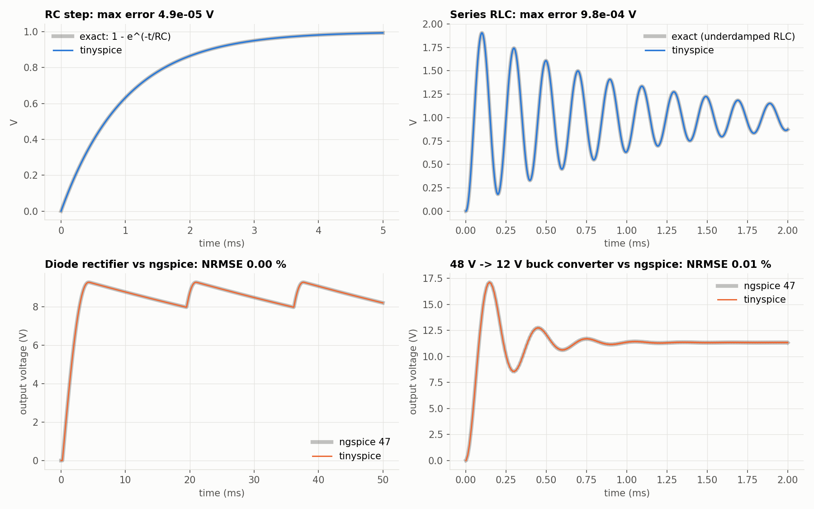
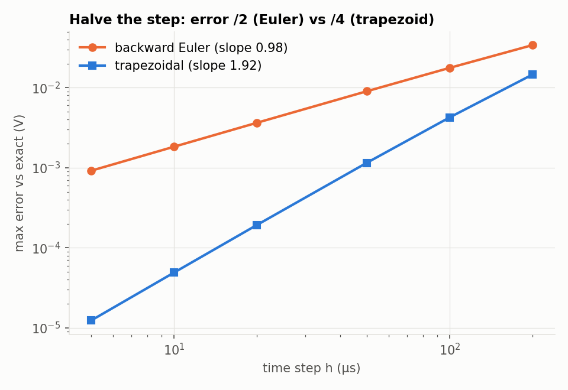
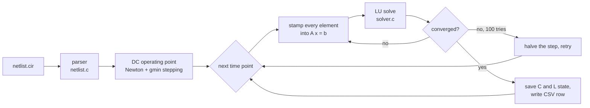

# tinyspice

A SPICE-style circuit simulator written from scratch in C (about 1,250 lines, no dependencies).
It reads a standard netlist, builds the circuit equations with **Modified Nodal Analysis**,
solves nonlinear devices with **Newton-Raphson**, and steps through time with the
**trapezoidal rule**, the same core ideas as SPICE, LTspice and ngspice.



## Results

| Test | Reference | Result |
|---|---|---|
| RC step response | exact: 1 − e^(−t/RC) | max error 4.9 × 10⁻⁵ V (h = 10 µs) |
| Series RLC step (ζ = 0.1) | exact underdamped solution | max error 0.98 mV; overshoot 90.49 % vs 90.54 % theory |
| Half-wave diode rectifier | ngspice 47 | 0.004 % RMS difference |
| 48 V → 12 V buck converter (switch + diode + LC) | ngspice 47 | 0.009 % RMS difference, V_out 11.340 V vs 11.340 V |
| Order of accuracy | theory: trapezoid = 2, Euler = 1 | measured slopes **1.92** and **0.98** |
| Unit tests (LU solver, unit suffixes, diode derivative, sources) | | 36 / 36 passing |

### Why the trapezoidal rule matters

Halving the time step cuts the error by 2× with backward Euler but by 4× with the
trapezoidal rule. That's the error bound for the trapezoid rule from calculus
(error ∝ h²), measured on a real circuit:



## How it works



**1. Modified Nodal Analysis.** Kirchhoff's current law at every node gives one equation per
node. Voltage sources and inductors add one extra unknown each (their current). The result
is a square linear system **A x = b**. Each element "stamps" a few numbers into A and b:

| Element | What it adds |
|---|---|
| resistor R between nodes a, b | +1/R on the diagonal at a and b, −1/R off-diagonal |
| current source | +I / −I in b |
| voltage source | a new row: V_a − V_b = V(t), and its current in the KCL rows |
| capacitor (each time step) | a resistor 2C/h plus a current source that remembers the past |
| inductor (each time step) | a new row: V_a − V_b − (2L/h)·i = −(2L/h)·i_prev − v_prev |
| diode | a linearized resistor + current source, recomputed every Newton iteration |

**2. Companion models (trapezoidal rule).** For a capacitor, i = C dv/dt. Integrating
over one step with the trapezoid area rule gives

    i_new = (2C/h)·v_new − [(2C/h)·v_prev + i_prev]

which is a conductance plus a known current source, so the capacitor becomes ordinary
resistive circuit elements at every time point.

**3. Newton-Raphson for diodes.** The diode current I = Is·(e^(V/nVt) − 1) is replaced
by its tangent line at the current guess. Solve, re-linearize at the new answer, repeat
until the answer stops moving. SPICE's junction-voltage limiting keeps Newton from
jumping into exponential overflow.

**4. Making it robust.**
- **Breakpoints:** the time stepper lands exactly on every corner of the PULSE/PWL sources.
- **Backward Euler after each corner:** the trapezoidal rule "rings" at discontinuities, so
  one Euler step is used there (SPICE does the same).
- **Step halving:** if Newton fails to converge, the step is retried at h/2.
- **gmin stepping:** if the DC operating point fails, start with large conductances to ground
  (an easy, almost linear problem) and remove them gradually.

## Usage

```bash
make                 # builds tinyspice (Windows: mingw32-make)
make test            # C unit tests
make validate        # compares against exact solutions and ngspice, redraws figures/
./tinyspice examples/buck.cir -o buck.csv
```

A netlist (`examples/buck.cir`):

```
Buck converter (non-synchronous) 48 V -> 12 V, 100 kHz
Vin in 0 dc 48
Vg g 0 pulse(0 5 0 10n 10n 2.49u 10u)
S1 in sw g 0 smod
D1 0 sw dmod
L1 sw out 47u
C1 out 0 47u
Rload out 0 2.4
.model smod sw(ron=10m roff=1meg vt=2.5)
.model dmod d(is=1e-9 n=1.5)
.tran 50n 2m
.end
```

Supported: `R C L V I D S E` elements; `dc`, `pulse`, `sin`, `pwl` sources; `.model` (diode `d`,
switch `sw`); `.tran`; SPICE unit suffixes (`f p n u m k meg g t`, and yes, `1M` means
1 milli, as in every SPICE).

## Layout

```
src/
  circuit.h     data structures (elements, models, sources)
  netlist.c     parser (tokenizer, unit suffixes, sources, .model, .tran)
  analysis.c    MNA stamping, Newton-Raphson, DC operating point, time stepping
  devices.c     source waveforms, diode equation and voltage limiting
  solver.c      LU decomposition with partial pivoting
  main.c        command line
tests/
  test_core.c   unit tests
  validate.py   accuracy study vs exact solutions and ngspice
examples/       RC, RLC, rectifier, buck converter, DC divider
```

## Limitations and next steps

- Dense matrix (O(n³)): fine for hundreds of nodes; a sparse LU would be needed for thousands.
- Fixed maximum step with halving on failure; SPICE also adapts the step from a local
  truncation-error estimate.
- Next: a MOSFET model, AC (small-signal) analysis, and the sparse solver.

## License

MIT
